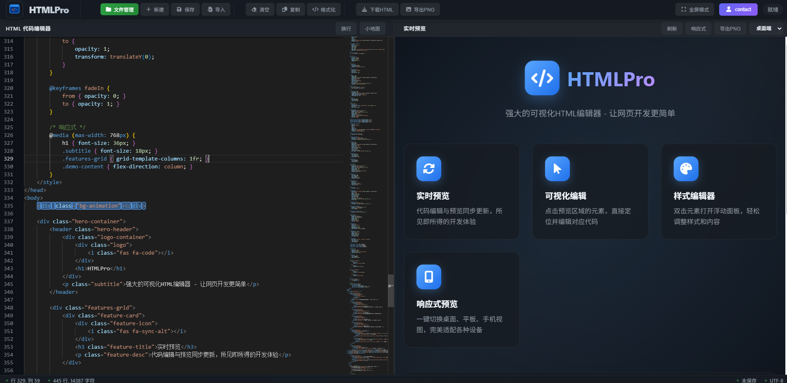

========================================
    HTMLPro 可视化HTML编辑器 v1.0.1
========================================

【快速启动】
直接双击 editor.html 文件即可开始使用！

【系统要求】
- 现代浏览器（Chrome/Edge/Firefox/Safari）
- 需要网络连接（首次加载依赖库）

【主要文件】
- editor.html        - 主程序入口（双击打开）
- HTMLPro使用说明.md - 详细使用说明
- logo.png          - 程序图标

【特别提示】
1. 所有文件都保存在浏览器本地，不会上传到服务器
2. 建议定期导出重要文件进行备份
3. 首次使用需要联网加载编辑器组件

【联系方式】
如有问题，请点击编辑器右上角"联系lius"按钮

祝您使用愉快！ 
